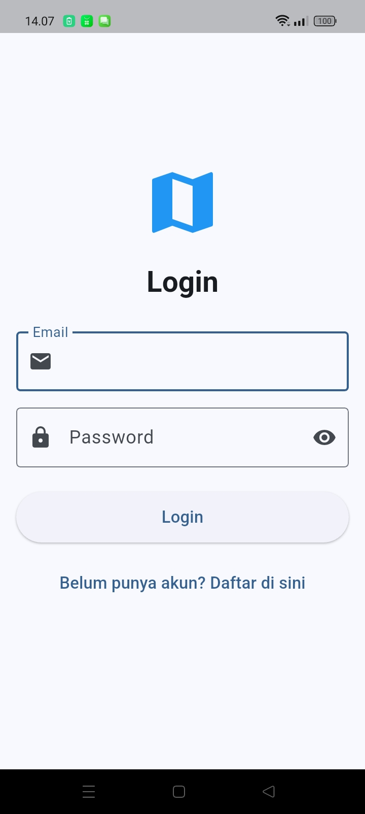
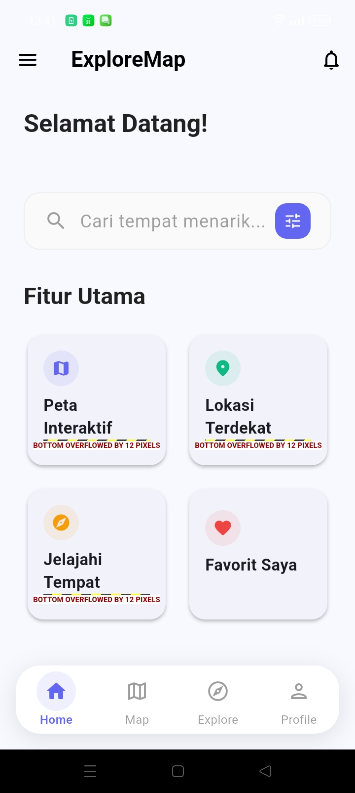
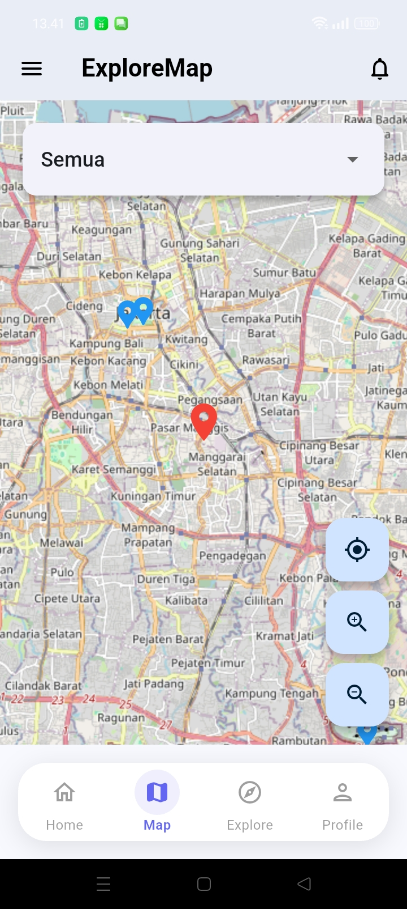
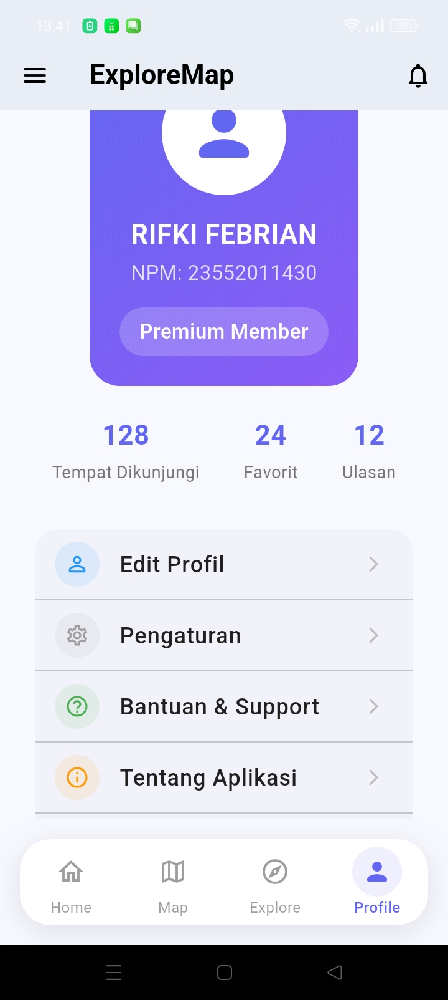

# 🚀 ExploreMap - Aplikasi Peta Interaktif

## 👤 IDENTITAS DEVELOPER
- **Nama:** Rifki Febrian  
- **NPM:** 23552011430  
- **Kelas:** 23 CID A  
- **Mata Kuliah:** Pemrograman Mobile 2  
- **Dosen:** Nova Agustina, S.T., M.Kom.  
- **Universitas:** Universitas Teknologi Bandung  
- **Tahun:** 2025  

---

# 📱 Tampilan Aplikasi

### 🟣 Splashscreen

### 🔐 Login

### 🏠 Dashboard

### 🗺️ Explore Maps

### 📍 Maps

  
  
  

  
  
  

  

---

# 📱 Tentang Aplikasi

**ExploreMap** adalah aplikasi peta interaktif yang memungkinkan pengguna menjelajahi tempat menarik di sekitar mereka.  
Aplikasi ini dikembangkan sebagai proyek mata kuliah *Pemrograman Mobile 2*.

---

# 🎯 Fitur Utama

### 1️⃣ Autentikasi Pengguna
- Login menggunakan email & password  
- Registrasi pengguna baru  
- Validasi form  

### 2️⃣ Dashboard Interaktif
- Statistik pengguna  
- Status akun  
- Navigasi praktis  

### 3️⃣ Peta Interaktif
- Google Maps API  
- Pencarian lokasi  
- Filter kategori  
- Marker detail informasi  

### 4️⃣ Explorasi Tempat
- Pencarian tempat menarik  
- Kategori: Landmark, Rekreasi, Sejarah  
- Rating & ulasan  
- Tempat populer  

### 5️⃣ Manajemen Profil
- Edit profil  
- Pengaturan aplikasi  
- Bantuan & support  
- Tentang aplikasi  

---
